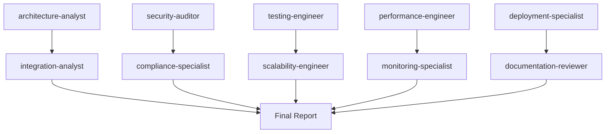

# 🎯 Multi-Tenant Pipeline Orchestration Plan

## **Project Analysis Overview**
**Target**: Complete production-ready multi-tenant CallRail ingestion pipeline
**Budget**: $4,300-8,700/month operational cost
**Timeline**: 26-week implementation (5-7 engineers)
**Status**: ✅ Complete technical specification ready for analysis

---

## 🚀 **IMMEDIATE 5-AGENT DEPLOYMENT (15-min micro-tasks)**

### **Wave 1: Parallel System Analysis**

#### **1. architecture-analyst**
- **MICRO-TASK**: Analyze Go microservices architecture and GCP integration (15 min max)
- **MCP TOOLS**:
  - Use `mcp__tavily__tavily_search` for latest GCP microservices best practices
  - Use `mcp__smithery-ai-github__search_repositories` for Go pipeline patterns
  - Use `mcp__smithery-ai-filesystem__list_directory` to analyze project structure
- **OUTPUT**: `.claude-team/reports/architecture-analysis.md`
- **SUCCESS CRITERIA**: Validate microservices design, identify scaling bottlenecks, assess GCP service integration

#### **2. security-auditor**
- **MICRO-TASK**: Review 2025 security baseline and multi-tenant isolation (15 min max)
- **MCP TOOLS**:
  - Use `mcp__tavily__tavily_search` for 2025 security compliance standards
  - Use `mcp__brave__brave_web_search` for HMAC verification best practices
  - Analyze existing security-baseline-2025.md
- **OUTPUT**: `.claude-team/reports/security-audit-detailed.md`
- **SUCCESS CRITERIA**: Validate security implementation, identify compliance gaps, assess tenant isolation

#### **3. testing-engineer**
- **MICRO-TASK**: Evaluate test execution framework and coverage strategy (15 min max)
- **MCP TOOLS**:
  - Use `mcp__upstash-context-7-mcp__resolve-library-id` for Go testing library docs
  - Use `mcp__smithery-ai-github__search_repositories` for testing patterns
  - Analyze existing TEST_EXECUTION_GUIDE.md
- **OUTPUT**: `.claude-team/reports/testing-assessment.md`
- **SUCCESS CRITERIA**: Validate test coverage targets, assess quality gates, identify testing gaps

#### **4. performance-engineer**
- **MICRO-TASK**: Analyze cost structure and performance targets (15 min max)
- **MCP TOOLS**:
  - Use `mcp__tavily__tavily_search` for GCP pricing optimization 2025
  - Use `mcp__brave__brave_web_search` for Vertex AI cost management
  - Analyze budget breakdown from executive summary
- **OUTPUT**: `.claude-team/reports/performance-cost-analysis.md`
- **SUCCESS CRITERIA**: Validate $4,300-8,700/month budget, assess performance SLAs, identify cost optimizations

#### **5. deployment-specialist**
- **MICRO-TASK**: Assess production readiness and infrastructure setup (15 min max)
- **MCP TOOLS**:
  - Use `mcp__tavily__tavily_search` for Cloud Run deployment best practices
  - Use `mcp__smithery-ai-filesystem__list_directory` to analyze deployment configs
  - Review Terraform and Docker configurations
- **OUTPUT**: `.claude-team/reports/deployment-readiness.md`
- **SUCCESS CRITERIA**: Validate deployment pipeline, identify production risks, assess monitoring setup

---

## 📋 **CONTINUOUS DEPLOYMENT PROTOCOL**

### **NEVER WAIT - ALWAYS 5 ACTIVE AGENTS**
When ANY agent completes (don't wait for all 5):

#### **PHASE 2 Deployments (Ready to deploy immediately):**

1. **integration-analyst**: Cross-agent findings integration and validation
2. **compliance-specialist**: GDPR/CCPA compliance deep dive
3. **scalability-engineer**: Auto-scaling and load testing analysis
4. **monitoring-specialist**: Observability and alerting assessment
5. **documentation-reviewer**: Technical documentation completeness audit

### **Agent Handoff Protocol:**
- **15-minute time limit** enforced for all micro-tasks
- If incomplete after 15 min → create handoff notes for next agent
- Immediate deployment of next agent in queue
- No waiting for "waves" - continuous rolling deployment

---

## 🔄 **COMMUNICATION FLOW**

### **Real-Time Coordination:**
- `.claude-team/communications/agent-status.json` - Live agent tracking
- `.claude-team/communications/cross-agent-findings.md` - Shared discoveries
- `.claude-team/communications/urgent-issues.md` - Critical findings requiring immediate attention

### **Agent Dependencies:**

---

## ✅ **SUCCESS CRITERIA & DELIVERABLES**

### **Final Deliverables for Dev Team:**
1. **Complete Architecture Assessment** - Microservices validation and scaling analysis
2. **Security Implementation Audit** - 2025 compliance readiness verification
3. **Testing Strategy Validation** - Coverage and quality gate assessment
4. **Cost & Performance Analysis** - Budget validation and optimization recommendations
5. **Production Deployment Checklist** - Step-by-step implementation roadmap

### **Orchestration Complete When:**
- All 10 agents have completed their assignments (5 initial + 5 follow-up)
- Cross-agent findings integrated and validated
- Critical issues identified and documented
- Clear recommendations provided for dev team
- Implementation timeline and budget validated

---

## 🎯 **CRITICAL SUCCESS FACTORS**

1. **Maintain 5 Active Agents**: Never fewer than 5 agents running
2. **15-Minute Micro-Tasks**: Enforce time limits to prevent bottlenecks
3. **MCP Tool Utilization**: All agents must leverage available MCP capabilities
4. **Continuous Deployment**: Deploy new agents immediately when others complete
5. **Cross-Agent Integration**: Ensure findings are integrated across specializations

**ORCHESTRATION STATUS**: 🟢 **READY TO DEPLOY AGENTS**