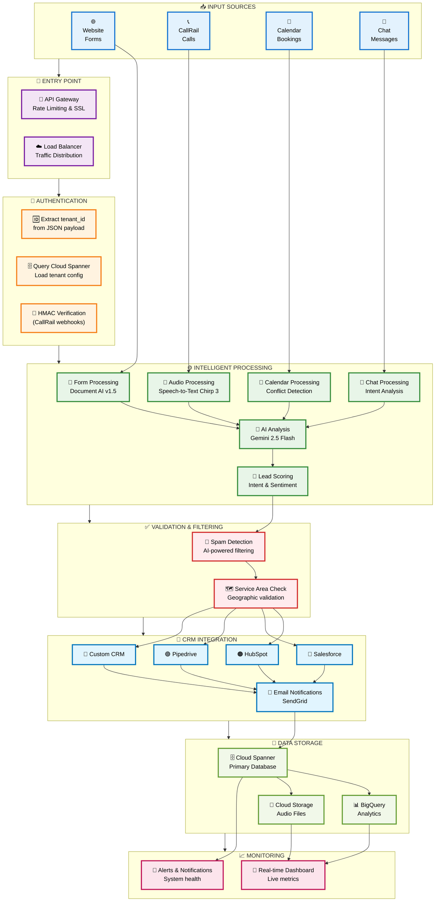
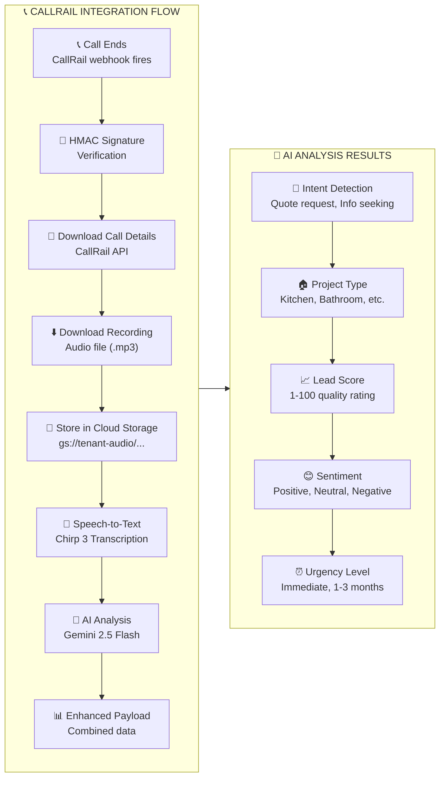

# 🎨 Multi-Tenant Pipeline - Visual Flowchart for Human Reading

## 🔄 Simplified System Overview



## 📋 Detailed CallRail Processing Flow



## 🎨 Human-Readable Process Summary

### **🔄 Step-by-Step Flow**

```
1. 📥 INPUT RECEIVED
   ├── Website form submission
   ├── CallRail phone call webhook
   ├── Calendar booking notification
   └── Chat message from widget

2. 🚪 GATEWAY PROCESSING
   ├── API Gateway handles request
   ├── Load balancer distributes traffic
   └── SSL termination & rate limiting

3. 🔐 AUTHENTICATION
   ├── Extract tenant_id from JSON
   ├── Query tenant configuration
   └── Verify webhook signatures (CallRail)

4. ⚙️ INTELLIGENT PROCESSING
   ├── Route by communication type
   ├── AI analysis (Gemini 2.5 Flash)
   ├── Audio transcription (Speech-to-Text)
   └── Lead scoring & sentiment analysis

5. ✅ VALIDATION & FILTERING
   ├── AI-powered spam detection
   └── Geographic service area check

6. 🔌 CRM INTEGRATION
   ├── Dynamic CRM selection
   ├── Field mapping & data transform
   ├── Push to HubSpot/Salesforce/etc.
   └── Email notifications (SendGrid)

7. 💾 DATA STORAGE
   ├── Cloud Spanner (primary database)
   ├── BigQuery (analytics warehouse)
   └── Cloud Storage (audio files)

8. 📈 MONITORING & ALERTS
   ├── Real-time dashboard updates
   └── System health monitoring
```

## 🎯 **Key Features Highlighted**

### **🔒 Security First**
- HMAC signature verification for CallRail webhooks
- Multi-tenant data isolation in Cloud Spanner
- Row-level security for all database operations

### **🧠 AI-Powered Intelligence**
- **Speech-to-Text Chirp 3**: Audio transcription with speaker diarization
- **Gemini 2.5 Flash**: Content analysis, lead scoring, sentiment analysis
- **Smart Routing**: AI-powered spam detection and service area validation

### **⚡ Performance & Scale**
- **Auto-scaling**: Cloud Run scales 0-1000 instances automatically
- **<200ms latency**: Fast webhook processing
- **99.9% availability**: Enterprise-grade reliability

### **🔌 Integration Flexibility**
- **Multi-CRM support**: HubSpot, Salesforce, Pipedrive, Custom APIs
- **Real-time notifications**: Email alerts via SendGrid
- **Live dashboard**: Server-Sent Events for real-time updates

## 💰 **Cost Structure**
- **Budget**: $4,300-8,700/month
- **Scales**: 100-500 concurrent tenants
- **Value**: Complete automation of lead processing pipeline

This visual flowchart shows how your multi-tenant ingestion pipeline processes customer communications through intelligent AI analysis and seamlessly integrates with existing business systems!