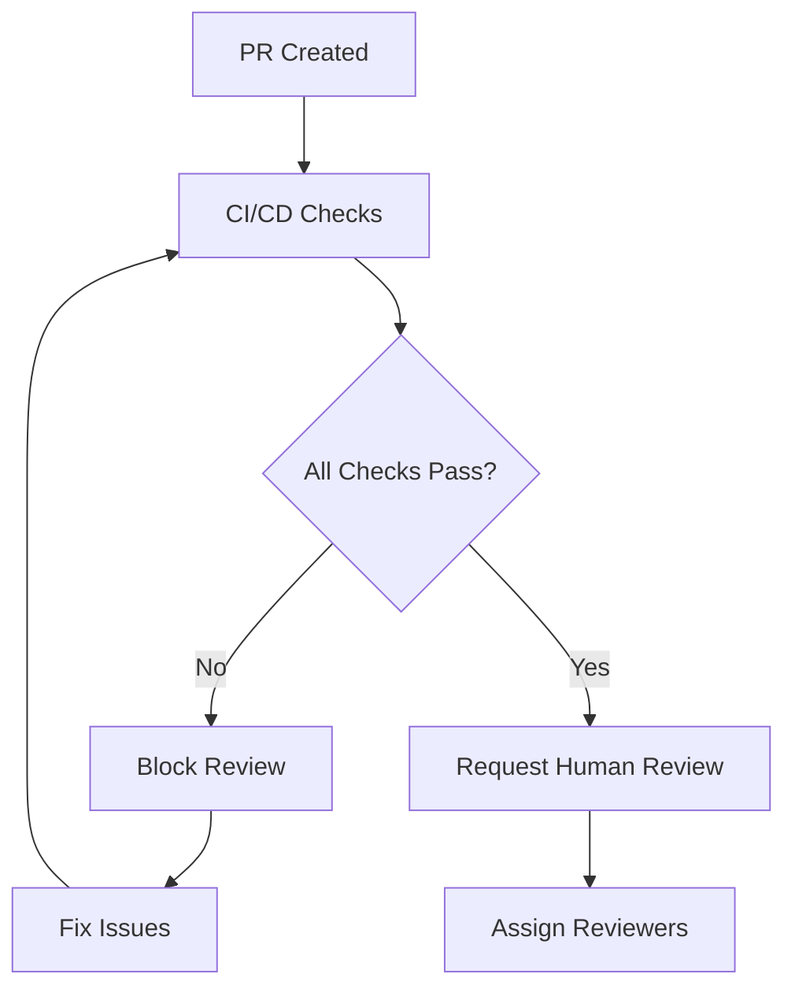

# Code Review Process & Guidelines

**Document Version**: 1.0
**Date**: September 13, 2025
**Project**: Multi-Tenant CallRail Integration Pipeline
**Team**: Engineering

---

## 🎯 **Review Process Overview**

This document defines the complete code review process for the multi-tenant ingestion pipeline project. It establishes quality gates, automated testing requirements, security scan integration, and performance benchmarking to ensure production-ready code.

---

## 🔄 **Code Review Workflow**

### **1. Pre-Review Phase**

#### **Developer Responsibilities**
```bash
# 1. Self-review checklist
□ Code follows project standards
□ All tests pass locally
□ Security scan passes
□ Documentation is updated
□ No merge conflicts exist

# 2. Automated quality checks
make fmt              # Format code
make lint             # Run linters
make test             # Run all tests
make security-scan    # Security analysis
make build            # Verify build
```

#### **Automated Pre-Checks** (CI/CD Pipeline)
```yaml
# .github/workflows/pr-checks.yml
name: PR Quality Checks
on:
  pull_request:
    branches: [main, develop]

jobs:
  quality-gates:
    runs-on: ubuntu-latest
    steps:
      - uses: actions/checkout@v3
      - uses: actions/setup-go@v3
        with:
          go-version: '1.21'

      # Code formatting
      - name: Check formatting
        run: |
          if [ "$(gofmt -s -l . | wc -l)" -gt 0 ]; then
            echo "Code is not formatted. Run 'go fmt ./...'"
            exit 1
          fi

      # Linting
      - name: Run golangci-lint
        uses: golangci/golangci-lint-action@v3
        with:
          version: latest
          args: --timeout 5m

      # Security scanning
      - name: Run security scan
        run: |
          go install github.com/securecodewarrior/gosec/v2/cmd/gosec@latest
          gosec -severity medium -confidence medium -fmt json -out security-report.json ./...

      # Dependency vulnerabilities
      - name: Check vulnerabilities
        run: |
          go install golang.org/x/vuln/cmd/govulncheck@latest
          govulncheck ./...

      # Unit tests
      - name: Run tests with coverage
        run: |
          go test -race -coverprofile=coverage.out -covermode=atomic ./...
          COVERAGE=$(go tool cover -func=coverage.out | grep total | awk '{print $3}' | sed 's/%//')
          if (( $(echo "$COVERAGE < 80" | bc -l) )); then
            echo "Test coverage $COVERAGE% is below 80% threshold"
            exit 1
          fi

      # Build verification
      - name: Build all services
        run: |
          cd cmd/webhook-processor && go build .
          cd ../audio-processor && go build .
          cd ../ai-analyzer && go build .
          cd ../workflow-engine && go build .
```

### **2. Review Assignment**

#### **Automatic Assignment Rules**
```yaml
# .github/CODEOWNERS
# Global reviewers
* @team-lead @senior-engineer

# Security-sensitive changes
/internal/auth/ @security-team @team-lead
/internal/callrail/ @security-team @integration-specialist
/pkg/security/ @security-team

# Database changes
/database/ @dba @backend-lead
/internal/spanner/ @dba @backend-lead

# Performance-critical paths
/internal/audio/ @performance-engineer @ml-engineer
/cmd/audio-processor/ @performance-engineer @ml-engineer

# API changes
/api/ @api-team @team-lead
/cmd/api-gateway/ @api-team @backend-lead

# Infrastructure
/deploy/ @devops-lead @cloud-architect
/terraform/ @devops-lead @cloud-architect
```

#### **Review Priority Matrix**
| Change Type | Reviewers Required | SLA |
|-------------|-------------------|-----|
| Hotfix | 1 Senior + Security | 2 hours |
| Security | 2 + Security Team | 4 hours |
| API Breaking | 2 + API Team | 8 hours |
| Database Schema | 2 + DBA | 12 hours |
| Feature | 2 Engineers | 24 hours |
| Documentation | 1 Engineer | 24 hours |

### **3. Review Phases**

#### **Phase 1: Automated Quality Gates**


#### **Phase 2: Security Review** (Security-Sensitive Changes)
- [ ] Security checklist completed
- [ ] Threat model updated if needed
- [ ] Penetration testing plan updated
- [ ] Compliance requirements verified
- [ ] Security team approval obtained

#### **Phase 3: Performance Review** (Performance-Critical Changes)
- [ ] Performance benchmarks run
- [ ] Memory usage analyzed
- [ ] Database query performance verified
- [ ] Load testing completed
- [ ] Performance regression check passed

#### **Phase 4: Architecture Review** (Architectural Changes)
- [ ] Design document updated
- [ ] Architecture principles followed
- [ ] Dependency analysis completed
- [ ] Scalability impact assessed
- [ ] Technical debt assessment

---

## 🧪 **Automated Testing Requirements**

### **Test Coverage Requirements**

#### **Unit Tests** (Required: 80% minimum)
```go
// Example comprehensive test structure
func TestCallRailWebhookProcessor(t *testing.T) {
    tests := []struct {
        name          string
        payload       []byte
        signature     string
        mockSetup     func(*mocks.MockTenantRepo)
        expectedError string
    }{
        {
            name:      "valid webhook processes successfully",
            payload:   validWebhookPayload,
            signature: validSignature,
            mockSetup: func(repo *mocks.MockTenantRepo) {
                repo.EXPECT().GetByCallRailID(gomock.Any(), "12345", "tenant-123").
                    Return(&models.Tenant{ID: "tenant-123"}, nil)
            },
        },
        {
            name:          "invalid signature rejected",
            payload:       validWebhookPayload,
            signature:     "invalid-signature",
            expectedError: "invalid HMAC signature",
        },
        {
            name:          "tenant not found",
            payload:       validWebhookPayload,
            signature:     validSignature,
            mockSetup: func(repo *mocks.MockTenantRepo) {
                repo.EXPECT().GetByCallRailID(gomock.Any(), "12345", "tenant-123").
                    Return(nil, repository.ErrTenantNotFound)
            },
            expectedError: "tenant not found",
        },
    }

    for _, tt := range tests {
        t.Run(tt.name, func(t *testing.T) {
            // Test implementation...
        })
    }
}
```

#### **Integration Tests** (Required for Critical Paths)
```go
// Example integration test
func TestCallRailIntegrationEndToEnd(t *testing.T) {
    if testing.Short() {
        t.Skip("Skipping integration test in short mode")
    }

    // Setup test environment
    ctx := context.Background()
    spannerClient := setupTestSpanner(t)
    defer cleanupTestSpanner(t, spannerClient)

    // Create test tenant
    tenant := createTestTenant(t, spannerClient)

    // Test webhook processing
    processor := NewWebhookProcessor(spannerClient, testConfig)
    payload := createTestWebhookPayload(tenant.ID)
    signature := generateTestSignature(payload)

    err := processor.ProcessCallRailWebhook(ctx, payload, signature)
    assert.NoError(t, err)

    // Verify data was stored correctly
    request := getStoredRequest(t, spannerClient, tenant.ID)
    assert.Equal(t, "CAL123456789", request.CallID)
    assert.Equal(t, tenant.ID, request.TenantID)
}
```

#### **Performance Tests** (Required for Performance-Critical Code)
```go
func BenchmarkAudioProcessing(b *testing.B) {
    processor := NewAudioProcessor(testConfig)
    audioData := generateTestAudioData(10 * 1024 * 1024) // 10MB

    b.ResetTimer()
    for i := 0; i < b.N; i++ {
        _, err := processor.ProcessAudio(context.Background(), audioData)
        if err != nil {
            b.Fatal(err)
        }
    }
}

func TestMemoryUsage(t *testing.T) {
    var m1, m2 runtime.MemStats
    runtime.GC()
    runtime.ReadMemStats(&m1)

    // Process large audio file
    processor := NewAudioProcessor(testConfig)
    audioData := generateTestAudioData(100 * 1024 * 1024) // 100MB
    _, err := processor.ProcessAudio(context.Background(), audioData)
    require.NoError(t, err)

    runtime.GC()
    runtime.ReadMemStats(&m2)

    // Memory usage should not exceed 50MB for processing 100MB file
    memoryUsed := m2.Alloc - m1.Alloc
    assert.Less(t, memoryUsed, uint64(50*1024*1024), "Memory usage too high: %d bytes", memoryUsed)
}
```

### **Test Environment Setup**

#### **Local Testing Environment**
```bash
# Makefile targets for local testing
.PHONY: test-setup
test-setup:
	docker-compose -f docker-compose.test.yml up -d
	./scripts/wait-for-services.sh
	./scripts/setup-test-data.sh

.PHONY: test-unit
test-unit:
	go test -short -race -coverprofile=coverage.out ./...

.PHONY: test-integration
test-integration: test-setup
	go test -tags=integration -race ./...

.PHONY: test-performance
test-performance:
	go test -bench=. -benchmem -cpu=1,2,4 ./...

.PHONY: test-all
test-all: test-unit test-integration test-performance
	go tool cover -html=coverage.out -o coverage.html
```

---

## 🔒 **Security Scan Integration**

### **Static Security Analysis**

#### **gosec Integration**
```bash
# Security scanning configuration
# .gosec.json
{
  "severity": "medium",
  "confidence": "medium",
  "rules": {
    "G101": "Look for hard coded credentials",
    "G102": "Bind to all interfaces",
    "G103": "Audit the use of unsafe block",
    "G104": "Audit errors not checked",
    "G401": "Detect the usage of DES, RC4, MD5 or SHA1"
  },
  "exclude": [
    "test_files/*"
  ]
}

# Run security scan
gosec -config .gosec.json -fmt json -out security-report.json ./...
```

#### **Dependency Vulnerability Scanning**
```bash
# Check for known vulnerabilities
govulncheck ./...

# Alternative: nancy for Go modules
go list -json -m all | nancy sleuth
```

### **Security Review Automation**

#### **Pre-commit Hooks**
```bash
#!/bin/sh
# .git/hooks/pre-commit

# Run security checks
echo "Running security checks..."
gosec -quiet ./...
if [ $? -ne 0 ]; then
    echo "Security check failed. Commit blocked."
    exit 1
fi

# Check for secrets
echo "Checking for secrets..."
git diff --cached --name-only | xargs grep -l "password\|secret\|key\|token" | head -1
if [ $? -eq 0 ]; then
    echo "Potential secret found. Please review."
    exit 1
fi

echo "All security checks passed."
```

#### **Security Gate in CI/CD**
```yaml
security-scan:
  runs-on: ubuntu-latest
  steps:
    - name: Run security scan
      run: |
        gosec -severity medium -confidence medium -fmt json ./...

    - name: Check for high severity issues
      run: |
        HIGH_COUNT=$(jq '.Stats.found_issues' security-report.json)
        if [ "$HIGH_COUNT" -gt 0 ]; then
          echo "High severity security issues found: $HIGH_COUNT"
          jq '.Issues[] | select(.severity == "HIGH")' security-report.json
          exit 1
        fi

    - name: Upload security report
      uses: actions/upload-artifact@v3
      with:
        name: security-report
        path: security-report.json
```

---

## 📊 **Performance Benchmarking**

### **Performance Test Categories**

#### **Latency Benchmarks**
```go
func BenchmarkWebhookProcessing(b *testing.B) {
    processor := NewWebhookProcessor(testConfig)
    payload := generateWebhookPayload()
    signature := generateSignature(payload)

    b.ResetTimer()
    for i := 0; i < b.N; i++ {
        start := time.Now()
        err := processor.ProcessCallRailWebhook(context.Background(), payload, signature)
        latency := time.Since(start)

        if err != nil {
            b.Fatal(err)
        }

        // Assert latency requirements
        if latency > 200*time.Millisecond {
            b.Fatalf("Latency %v exceeds 200ms requirement", latency)
        }
    }
}
```

#### **Throughput Benchmarks**
```go
func BenchmarkConcurrentWebhookProcessing(b *testing.B) {
    processor := NewWebhookProcessor(testConfig)

    b.RunParallel(func(pb *testing.PB) {
        for pb.Next() {
            payload := generateWebhookPayload()
            signature := generateSignature(payload)

            err := processor.ProcessCallRailWebhook(context.Background(), payload, signature)
            if err != nil {
                b.Fatal(err)
            }
        }
    })
}
```

### **Performance Regression Detection**

#### **Automated Performance Testing**
```bash
# Performance regression test script
#!/bin/bash

# Run current performance tests
go test -bench=. -benchmem -count=5 ./... > current-perf.txt

# Compare with baseline
if [ -f baseline-perf.txt ]; then
    benchcmp baseline-perf.txt current-perf.txt

    # Check for regressions > 20%
    if benchcmp baseline-perf.txt current-perf.txt | grep -E '\+[2-9][0-9]%|\+[0-9]{3,}%'; then
        echo "Performance regression detected!"
        exit 1
    fi
else
    echo "No baseline found. Creating baseline..."
    cp current-perf.txt baseline-perf.txt
fi
```

#### **Load Testing Integration**
```yaml
# Load testing with k6
load-test:
  runs-on: ubuntu-latest
  steps:
    - name: Deploy to staging
      run: ./scripts/deploy-staging.sh

    - name: Run load tests
      run: |
        docker run --rm -v $(pwd)/tests:/tests grafana/k6 run /tests/webhook-load-test.js

    - name: Check performance metrics
      run: |
        if [ "$(cat load-test-results.json | jq '.metrics.http_req_duration.avg')" -gt 500 ]; then
          echo "Average response time exceeds 500ms"
          exit 1
        fi
```

---

## 📋 **Review Quality Metrics**

### **Code Quality Metrics**

#### **Automated Metrics Collection**
```go
// Complexity analysis
func calculateCyclomaticComplexity(pkg string) int {
    cmd := exec.Command("gocyclo", "-avg", pkg)
    output, _ := cmd.Output()
    // Parse and return complexity score
}

// Technical debt assessment
func assessTechnicalDebt() TechnicalDebtReport {
    return TechnicalDebtReport{
        CodeDuplication:    calculateDuplication(),
        TestCoverage:      calculateCoverage(),
        DocumentationCoverage: calculateDocCoverage(),
        DependencyHealth:  assessDependencies(),
    }
}
```

#### **Quality Gates**
| Metric | Threshold | Action if Failed |
|--------|-----------|------------------|
| Test Coverage | ≥80% | Block merge |
| Cyclomatic Complexity | ≤10 per function | Require refactoring |
| Code Duplication | ≤5% | Create refactoring task |
| Security Issues | 0 high/critical | Block merge |
| Performance Regression | ≤10% slower | Performance review |

### **Review Process Metrics**

#### **Efficiency Metrics**
```sql
-- Review time tracking
SELECT
    pr_id,
    created_at,
    first_review_at,
    approved_at,
    EXTRACT(EPOCH FROM (first_review_at - created_at))/3600 as hours_to_first_review,
    EXTRACT(EPOCH FROM (approved_at - created_at))/3600 as total_review_hours
FROM pull_requests
WHERE created_at >= DATE_SUB(NOW(), INTERVAL 30 DAY);
```

#### **Quality Metrics Dashboard**
```yaml
# Grafana dashboard queries
review_sla_adherence:
  query: |
    (count(rate(pull_request_review_duration_hours{status="on_time"}[7d])) /
     count(rate(pull_request_review_duration_hours[7d]))) * 100

defect_escape_rate:
  query: |
    count(rate(production_bugs{source="missed_in_review"}[30d])) /
    count(rate(deployments[30d])) * 100

review_coverage:
  query: |
    count(rate(pull_requests{reviewers=">=2"}[7d])) /
    count(rate(pull_requests[7d])) * 100
```

---

## 🎯 **Continuous Improvement**

### **Review Process Optimization**

#### **Weekly Review Retrospectives**
```markdown
## Review Retrospective Template

### Metrics This Week
- Average review time: _____ hours
- Review SLA adherence: _____%
- Defects found in review: _____
- Defects escaped to production: _____

### What Went Well
-
-
-

### What Could Be Improved
-
-
-

### Action Items
- [ ]
- [ ]
- [ ]
```

#### **Automated Process Improvements**
```go
// Review analytics system
type ReviewAnalytics struct {
    db     *sql.DB
    logger *zap.Logger
}

func (ra *ReviewAnalytics) AnalyzeReviewPatterns() ReviewInsights {
    // Analyze review data to identify patterns
    insights := ReviewInsights{
        BottleneckAreas:     ra.identifyBottlenecks(),
        ReviewerWorkload:    ra.analyzeReviewerWorkload(),
        QualityTrends:      ra.analyzeQualityTrends(),
        RecommendedActions: ra.generateRecommendations(),
    }

    return insights
}
```

### **Training & Knowledge Sharing**

#### **Review Skills Development**
- [ ] Security review training for all engineers
- [ ] Performance optimization workshops
- [ ] Code review best practices sessions
- [ ] Tool training (gosec, golangci-lint, etc.)

#### **Knowledge Base Maintenance**
- [ ] Update coding standards quarterly
- [ ] Maintain review examples and anti-patterns
- [ ] Document lessons learned from incidents
- [ ] Create review quick reference guides

---

This comprehensive review process ensures that the multi-tenant ingestion pipeline maintains the highest standards of code quality, security, and performance while enabling efficient development workflows.