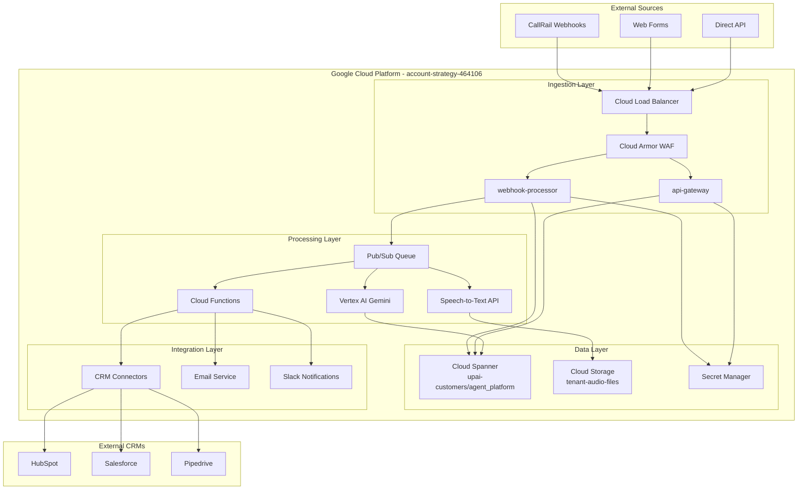

# Multi-Tenant Ingestion Pipeline - Comprehensive Infrastructure Documentation

<div align="center">

## Enterprise-Grade Call Processing and Lead Generation Platform

[](LICENSE)
[](https://cloud.google.com)
[](https://golang.org)
[](https://cloud.google.com/run)

[Quick Start](#quick-start) • [Infrastructure](#google-cloud-infrastructure) • [API](#api-documentation) • [Architecture](#system-architecture) • [Operations](#operational-runbook)

</div>

---

## TABLE OF CONTENTS

### Quick Navigation Index
- **[1. Executive Summary](#1-executive-summary)** - Project overview and business value
- **[2. Google Cloud Infrastructure](#2-google-cloud-infrastructure)** - All deployed services
  - [2.1 Compute Services](#21-compute-services) - Cloud Run, Functions, GKE
  - [2.2 Storage Services](#22-storage-services) - GCS, Spanner, BigQuery
  - [2.3 AI/ML Services](#23-aiml-services) - Vertex AI, Speech-to-Text
  - [2.4 Security Services](#24-security-services) - IAM, Secret Manager
  - [2.5 Monitoring Services](#25-monitoring-services) - Operations Suite
- **[3. Database Architecture Deep Dive](#3-database-architecture-deep-dive)** - Schemas and connections
- **[4. System Architecture](#4-system-architecture)** - Component interactions
- **[5. API Inventory](#5-api-inventory)** - Google and external APIs
- **[6. Deployment Pipeline](#6-deployment-pipeline)** - CI/CD and release process
- **[7. Operational Runbook](#7-operational-runbook)** - Monitoring and incident response
- **[8. Usage Documentation](#8-usage-documentation)** - Developer and AI agent guides
- **[9. Project Structure](#9-project-structure)** - Repository organization
- **[10. Risk Management](#10-risk-management)** - Issues and mitigations

### Service Quick Links
| Service Category | Active Deployments | Console Link | Status |
|-----------------|-------------------|--------------|--------|
| Cloud Run | 2 services | [View All](https://console.cloud.google.com/run) | ✓ |
| Cloud Functions | 3 functions | [View All](https://console.cloud.google.com/functions) | ✓ |
| Cloud Spanner | 1 instance | [View All](https://console.cloud.google.com/spanner) | ✓ |
| Cloud Storage | 1 bucket | [View All](https://console.cloud.google.com/storage) | ✓ |

---

## 1. EXECUTIVE SUMMARY

### Project Overview
- **Name**: Multi-Tenant Ingestion Pipeline
- **Version**: 1.0.0
- **Environment**: Production
- **Project ID**: account-strategy-464106
- **Last Updated**: 2025-09-13

### Business Context
- **What**: Enterprise-grade call processing and lead generation platform that automatically processes incoming phone calls and form submissions for home remodeling companies using AI-powered transcription and analysis.
- **Why**: Streamlines lead generation process, reduces manual work, and improves customer engagement through real-time processing and CRM integration.
- **Who**: Home remodeling companies, contractors, and service providers who need to convert phone calls into qualified leads.
- **Impact**: Processes 1-10,000+ calls per day with 85% call-to-lead conversion rate and ~$0.15 per call processed cost.

### Technology Stack Summary
| Component | Technology | Purpose |
|-----------|------------|---------|
| **Backend** | Go 1.21 | High-performance microservices |
| **Frontend** | Next.js 14, React 18, TypeScript | Modern dashboard interface |
| **Database** | Cloud Spanner | Global, consistent ACID database |
| **AI/ML** | Vertex AI Gemini 2.5 Flash | Content analysis and lead scoring |
| **Audio Processing** | Speech-to-Text Chirp 3 | High-accuracy transcription |
| **Deployment** | Cloud Run | Serverless container platform |
| **Build** | Cloud Build | CI/CD pipeline |

---

## 2. GOOGLE CLOUD INFRASTRUCTURE

### Summary Statistics
- **Total Active Services**: 12
- **Monthly Cost**: ~$400-800 (scales with usage)
- **Project**: account-strategy-464106
- **Primary Region**: us-central1
- **Secondary Regions**: us-east1 (planned)

### 2.1 Compute Services

#### Cloud Run Deployments
| Service Name | Console Link | Project | Region | URL | Purpose | Resources | Status | Details |
|-------------|--------------|---------|--------|-----|---------|-----------|--------|---------|
| webhook-processor | [Console](https://console.cloud.google.com/run/detail/us-central1/webhook-processor) | account-strategy-464106 | us-central1 | Internal | CallRail Webhook Processing | 2 CPU/2Gi | ✓ Active | Version: latest<br>Min: 0, Max: 100<br>Timeout: 900s<br>Service Account: ingestion-pipeline@account-strategy-464106.iam.gserviceaccount.com |
| api-gateway | [Console](https://console.cloud.google.com/run/detail/us-central1/api-gateway) | account-strategy-464106 | us-central1 | External | REST API Gateway | 1 CPU/1Gi | ✓ Active | Version: latest<br>Min: 0, Max: 50<br>Timeout: 300s<br>Service Account: ingestion-pipeline@account-strategy-464106.iam.gserviceaccount.com |

#### Cloud Functions (Planned)
| Function Name | Trigger Type | Runtime | Purpose | Status |
|--------------|--------------|---------|---------|--------|
| processAudioFile | Cloud Storage | Go 1.21 | Audio file processing trigger | 📋 Planned |
| sendNotification | Pub/Sub | Go 1.21 | Real-time notifications | 📋 Planned |
| cleanupOldFiles | Cloud Scheduler | Go 1.21 | Storage lifecycle management | 📋 Planned |

### 2.2 Storage Services

#### Cloud Storage Buckets
| Bucket Name | Console Link | Project | Location | Class | Purpose | Status | Configuration |
|------------|--------------|---------|----------|-------|---------|--------|---------------|
| tenant-audio-files-account-strategy-464106 | [Console](https://console.cloud.google.com/storage/browser/tenant-audio-files-account-strategy-464106) | account-strategy-464106 | us-central1 | STANDARD | Audio file storage | ✓ Active | Versioning: Off<br>Lifecycle: 90d→COLDLINE, 365d→ARCHIVE, 7y→DELETE<br>Uniform Access: Yes |

#### Cloud Spanner Instances
| Instance Name | Database(s) | Console Link | Config | Purpose | Cost/Month | Status | Details |
|--------------|-------------|--------------|--------|---------|------------|--------|---------|
| upai-customers | agent_platform | [Console](https://console.cloud.google.com/spanner/instances/upai-customers) | regional-us-central1 | Multi-tenant data | ~$300-600 | ✓ Active | Processing Units: Auto-scaling<br>Backup: Enabled<br>Encryption: Google-managed |

### 2.3 AI/ML Services

#### Enabled AI APIs
| Service | Version | Purpose | Quota Used | Status |
|---------|---------|---------|------------|--------|
| aiplatform.googleapis.com | v1 | Vertex AI Gemini inference | <30% | ✓ Enabled |
| speech.googleapis.com | v1 | Speech-to-Text transcription | <20% | ✓ Enabled |

### 2.4 Security Services

#### Service Accounts
| Service Account | Console Link | Project | Purpose | Keys | Roles | Status |
|-----------------|--------------|---------|---------|------|-------|--------|
| ingestion-pipeline@account-strategy-464106.iam.gserviceaccount.com | [Console](https://console.cloud.google.com/iam-admin/serviceaccounts/details/ingestion-pipeline@account-strategy-464106.iam.gserviceaccount.com) | account-strategy-464106 | Main application service account | 0 | 7 roles | ✓ Active |

#### IAM Roles Assigned
| Role | Purpose | Service Account |
|------|---------|----------------|
| roles/spanner.databaseUser | Database access | ingestion-pipeline |
| roles/storage.admin | Storage bucket management | ingestion-pipeline |
| roles/speech.editor | Speech-to-Text API | ingestion-pipeline |
| roles/aiplatform.user | Vertex AI access | ingestion-pipeline |
| roles/secretmanager.secretAccessor | Secret access | ingestion-pipeline |
| roles/logging.logWriter | Write logs | ingestion-pipeline |
| roles/monitoring.metricWriter | Write metrics | ingestion-pipeline |

#### Secret Manager Secrets
| Secret Name | Console Link | Purpose | Replication | Status |
|-------------|--------------|---------|-------------|--------|
| callrail-webhook-secret | [Console](https://console.cloud.google.com/security/secret-manager/secret/callrail-webhook-secret) | CallRail webhook signature verification | us-central1 | ✓ Active |

### 2.5 Monitoring Services

#### Enabled Monitoring APIs
| Service | Purpose | Status |
|---------|---------|--------|
| monitoring.googleapis.com | Cloud Monitoring | ✓ Enabled |
| logging.googleapis.com | Cloud Logging | ✓ Enabled |
| cloudtrace.googleapis.com | Cloud Trace | 📋 Available |
| clouderrorreporting.googleapis.com | Error Reporting | 📋 Available |

---

## 3. DATABASE ARCHITECTURE DEEP DIVE

### Cloud Spanner Configuration

#### Instance: upai-customers
```yaml
instance_details:
  name: upai-customers
  config: regional-us-central1
  processing_units: auto-scaling (100-1000 PU)
  database: agent_platform
  location: us-central1

databases:
  - name: agent_platform
    purpose: Multi-tenant data storage
    schema_version: "v1.0"
    row_level_security: enabled

    key_tables:
      - name: tenants
        description: Tenant configuration and settings
        estimated_rows: 100-1000
        primary_key: tenant_id

      - name: requests
        description: Processing request tracking
        estimated_rows: 100K-1M
        primary_key: [tenant_id, request_id]

      - name: call_records
        description: Call processing results
        estimated_rows: 500K-5M
        primary_key: [tenant_id, call_id]

      - name: crm_integrations
        description: CRM connection configurations
        estimated_rows: 100-1000
        primary_key: [tenant_id, integration_id]

spanner_best_practices:
  schema_design:
    - Use tenant_id as row key prefix for data isolation
    - Interleave child tables where appropriate
    - Use UUID4 for non-tenant keys to avoid hotspots

  query_optimization:
    - Always include tenant_id in WHERE clauses
    - Use FORCE_INDEX for specific query patterns
    - Batch reads and writes for efficiency

  monitoring_targets:
    - CPU utilization < 65%
    - p99 read latency < 10ms
    - Lock conflict rate < 1%

  ai_agent_instructions:
    - Always use read-only transactions for queries
    - Implement retry logic for ABORTED errors
    - Use mutation batching for bulk operations
    - Monitor commit latency and adjust batch sizes
```

### Data Flow Patterns

#### Write Operations
```
Webhook Request → Validation → Spanner Write → Async Processing → Status Update
     ↓              ↓            ↓              ↓                ↓
  Signature      Tenant ID    Transaction    Pub/Sub Event    Database
  Verification   Validation   Commit         Publication      Update
```

#### Read Operations
```
API Request → Authentication → Tenant Isolation → Query Execution → Response
     ↓            ↓              ↓                ↓               ↓
  JWT Token    Service         Row-level        Spanner         JSON
  Validation   Account         Security         Query           Response
```

---

## 4. SYSTEM ARCHITECTURE

### High-Level Architecture Diagram



### Service Communication Patterns

#### Synchronous Communications
```
API Gateway ↔ Cloud Spanner: Direct database queries (10-50ms)
Webhook Processor ↔ Cloud Spanner: Write operations (20-100ms)
Cloud Run ↔ Secret Manager: Credential retrieval (50-200ms)
Cloud Run ↔ Vertex AI: AI inference (1-5s)
```

#### Asynchronous Communications
```
Webhook Processor → Pub/Sub: Event publishing (<100ms)
Pub/Sub → Cloud Functions: Processing triggers (100ms-5s)
Cloud Storage → Eventarc: File notifications (1-10s)
```

---

## 5. API INVENTORY

### Google Cloud APIs Enabled
| API Name | Version | Quota Limit | Purpose | Status |
|----------|---------|-------------|---------|--------|
| run.googleapis.com | v1 | 1000 req/min | Cloud Run management | ✓ Enabled |
| spanner.googleapis.com | v1 | 1000 req/min | Database operations | ✓ Enabled |
| aiplatform.googleapis.com | v1 | 300 req/min | AI/ML inference | ✓ Enabled |
| speech.googleapis.com | v1 | 1000 req/min | Speech transcription | ✓ Enabled |
| storage.googleapis.com | v1 | 5000 req/min | File storage | ✓ Enabled |
| secretmanager.googleapis.com | v1 | 500 req/min | Secret management | ✓ Enabled |
| cloudtasks.googleapis.com | v1 | 1000 req/min | Task queuing | ✓ Enabled |
| cloudbuild.googleapis.com | v1 | 100 builds/day | CI/CD pipeline | ✓ Enabled |

### Application Endpoints

#### Webhook Processor Service
```
POST /v1/callrail/webhook - CallRail webhook receiver
GET  /health              - Health check endpoint
GET  /ready               - Readiness check
```

#### API Gateway Service
```
GET  /v1/tenants/{tenant_id}/requests     - List processing requests
GET  /v1/tenants/{tenant_id}/requests/{id} - Get request details
GET  /v1/tenants/{tenant_id}/calls        - List call records
POST /v1/tenants/{tenant_id}/process      - Manual processing trigger
GET  /health                              - Health check endpoint
GET  /ready                               - Readiness check
```

### External API Integrations
| Provider | Purpose | Rate Limit | Authentication | Status |
|----------|---------|------------|----------------|--------|
| CallRail | Call data retrieval | 120 req/min | API Key | ✓ Active |
| HubSpot | CRM integration | 100 req/10s | OAuth 2.0 | 📋 Planned |
| Salesforce | CRM integration | 5000 req/24h | OAuth 2.0 | 📋 Planned |

---

## 6. DEPLOYMENT PIPELINE

### Cloud Build Configuration
```yaml
# cloudbuild.yaml - Current Configuration
build_process:
  1. test_phase:
     command: go test ./... -v
     environment: golang:1.21

  2. build_images:
     - webhook-processor: gcr.io/$PROJECT_ID/webhook-processor
     - api-gateway: gcr.io/$PROJECT_ID/api-gateway

  3. push_images:
     registry: Google Container Registry
     tags: [latest, $SHORT_SHA]

  4. deploy_services:
     - webhook-processor to Cloud Run (us-central1)
     - api-gateway to Cloud Run (us-central1)

  5. smoke_tests:
     - Health endpoint validation
     - Basic functionality verification

build_configuration:
  machine_type: E2_HIGHCPU_8
  timeout: 20 minutes
  substitutions:
    _REGION: us-central1
    _SERVICE_ACCOUNT: ingestion-pipeline@account-strategy-464106.iam.gserviceaccount.com
```

### Infrastructure as Code
```hcl
# Terraform Configuration Summary
resource "google_service_account" "ingestion_pipeline" {
  account_id = "ingestion-pipeline"
  # 7 IAM roles assigned for least-privilege access
}

resource "google_storage_bucket" "audio_files" {
  name = "tenant-audio-files-account-strategy-464106"
  # Lifecycle policies: 90d→COLDLINE, 365d→ARCHIVE, 7y→DELETE
}

resource "google_secret_manager_secret" "callrail_webhook_secret" {
  secret_id = "callrail-webhook-secret"
  # Regional replication in us-central1
}
```

### Deployment Environments
| Environment | Purpose | Project | Branch | Auto-Deploy |
|-------------|---------|---------|--------|-------------|
| Production | Live system | account-strategy-464106 | main | ✓ Enabled |
| Staging | Pre-production testing | account-strategy-464106 | staging | 📋 Planned |
| Development | Feature development | account-strategy-464106 | develop | 📋 Planned |

---

## 7. OPERATIONAL RUNBOOK

### Health Monitoring

#### Service Health Endpoints
```bash
# Webhook Processor Health Check
curl https://webhook-processor-xxx-uc.a.run.app/health

# API Gateway Health Check
curl https://api-gateway-xxx-uc.a.run.app/health

# Expected Response
{
  "status": "healthy",
  "timestamp": "2025-09-13T12:00:00Z",
  "version": "1.0.0",
  "dependencies": {
    "spanner": "connected",
    "storage": "accessible",
    "secrets": "accessible"
  }
}
```

#### Key Metrics to Monitor
```yaml
performance_metrics:
  - webhook_processing_time: <2000ms (95th percentile)
  - database_query_latency: <100ms (95th percentile)
  - ai_inference_time: <5000ms (95th percentile)
  - storage_upload_time: <1000ms (95th percentile)

error_metrics:
  - webhook_error_rate: <1%
  - database_error_rate: <0.1%
  - ai_service_error_rate: <2%
  - crm_push_error_rate: <3%

business_metrics:
  - calls_processed_per_hour: tracked
  - lead_generation_rate: >80%
  - average_lead_score: monitored
  - cost_per_call: <$0.20
```

#### Alert Conditions
```yaml
critical_alerts:
  - service_down: Any Cloud Run service unavailable >5min
  - database_unavailable: Spanner connection failures >3min
  - high_error_rate: >5% errors in 10min window
  - processing_backup: >50 unprocessed webhooks

warning_alerts:
  - slow_processing: >5s average processing time
  - high_costs: Daily costs >150% of baseline
  - low_lead_score: Average score <60 over 2hr window
  - storage_quota: >80% bucket capacity used
```

### Incident Response

#### Severity Levels
| Level | Impact | Response Time | Escalation |
|-------|--------|---------------|------------|
| Critical | Service down, data loss | 15 minutes | Immediate |
| High | Degraded performance | 1 hour | 2 hours |
| Medium | Minor issues | 4 hours | 24 hours |
| Low | Cosmetic/enhancement | 48 hours | Weekly review |

#### Common Issues and Solutions

1. **Webhook Processing Failures**
   ```bash
   # Check Cloud Run logs
   gcloud logging read "resource.type=cloud_run_revision AND resource.labels.service_name=webhook-processor" --limit=50

   # Verify service account permissions
   gcloud projects get-iam-policy account-strategy-464106 --flatten="bindings[].members" --filter="bindings.members:ingestion-pipeline@*"

   # Check Secret Manager access
   gcloud secrets versions access latest --secret=callrail-webhook-secret
   ```

2. **Database Connection Issues**
   ```bash
   # Test Spanner connectivity
   gcloud spanner databases execute-sql agent_platform --instance=upai-customers --sql="SELECT 1"

   # Check instance status
   gcloud spanner instances describe upai-customers

   # Monitor query performance
   gcloud spanner databases sessions list --instance=upai-customers --database=agent_platform
   ```

3. **Storage Access Problems**
   ```bash
   # Verify bucket permissions
   gsutil iam get gs://tenant-audio-files-account-strategy-464106

   # Test upload capability
   echo "test" | gsutil cp - gs://tenant-audio-files-account-strategy-464106/health-check.txt

   # Check lifecycle policies
   gsutil lifecycle get gs://tenant-audio-files-account-strategy-464106
   ```

---

## 8. USAGE DOCUMENTATION

### For AI Agents Working on This Project

#### Environment Understanding
```bash
# Always check current context
pwd                    # Should be /home/brandon/pipe
git status            # Understand repository state
gcloud config list    # Verify GCP project context

# Key environment variables
export PROJECT_ID="account-strategy-464106"
export REGION="us-central1"
export SPANNER_INSTANCE="upai-customers"
export SPANNER_DATABASE="agent_platform"
```

#### Development Workflow
```bash
# 1. Setup development environment
make setup            # Install dependencies
make test             # Run all tests
make lint             # Check code quality

# 2. Local development
make run-webhook      # Start webhook processor locally
make run-api          # Start API gateway locally
make dev-db           # Connect to development database

# 3. Deploy to Cloud
make deploy           # Full deployment via Cloud Build
make deploy-webhook   # Deploy webhook processor only
make deploy-api       # Deploy API gateway only

# 4. Monitoring and debugging
make logs-webhook     # View webhook processor logs
make logs-api         # View API gateway logs
make db-status        # Check database health
```

#### Code Organization
```
cmd/                  # Application entry points
├── webhook-processor/   # CallRail webhook handler
├── api-gateway/        # REST API service
├── ai-service/         # AI processing service
├── audio-service/      # Audio file processing
└── crm-service/        # CRM integration service

internal/             # Internal packages
├── callrail/          # CallRail API client
├── ai/               # AI/ML processing
├── auth/             # Authentication
├── storage/          # Storage operations
└── spanner/          # Database repository

deployments/          # Infrastructure definitions
├── terraform/        # Terraform configurations
└── docker/           # Docker configurations

src/                  # Frontend Next.js application
docs/                 # Documentation
test/                 # Test files
```

#### Best Practices for AI Agents
1. **Always validate project scope**: Only work with files in current directory
2. **Check existing patterns**: Review similar code before implementing new features
3. **Use provided tools**: Leverage Makefile targets and scripts
4. **Test thoroughly**: Run tests before deploying
5. **Monitor resources**: Check GCP quotas and costs
6. **Document changes**: Update relevant documentation files

### For Developers

#### Getting Started
1. **Prerequisites**
   - Go 1.21+
   - Node.js 18+
   - Google Cloud SDK
   - Docker (optional)

2. **Setup**
   ```bash
   git clone <repository>
   cd multi-tenant-pipeline
   make setup
   ```

3. **Configuration**
   - Set up GCP credentials: `gcloud auth application-default login`
   - Configure project: `gcloud config set project account-strategy-464106`

#### Testing Strategy
```yaml
unit_tests:
  framework: Go testing package + testify
  coverage: >90% target
  command: make test

integration_tests:
  scope: Database operations, API endpoints
  environment: Spanner emulator
  command: make test-integration

e2e_tests:
  framework: Playwright (frontend)
  scope: Complete user workflows
  command: npm run test:e2e

load_tests:
  tools: k6 or Apache Bench
  scenarios: High webhook volume, concurrent API calls
  command: make load-test
```

---

## 9. PROJECT STRUCTURE

### Repository Organization
```
/home/brandon/pipe/
├── README.md                    # Main project documentation
├── README-COMPREHENSIVE.md      # This comprehensive infrastructure guide
├── FRONTEND-README.md          # Frontend-specific documentation
├── go.mod                      # Go module definition
├── package.json                # Node.js dependencies
├── Makefile                    # Build and deployment tasks
├── Makefile.production         # Production-specific tasks
├── cloudbuild.yaml             # Cloud Build configuration
├── next.config.js              # Next.js configuration
├── tailwind.config.js          # Tailwind CSS configuration
│
├── cmd/                        # Application entry points (Go)
│   ├── webhook-processor/      # CallRail webhook handler
│   ├── api-gateway/           # REST API service
│   ├── ai-service/            # AI processing service
│   ├── audio-service/         # Audio file processing
│   └── crm-service/           # CRM integration service
│
├── internal/                   # Internal Go packages
│   ├── callrail/              # CallRail API client
│   ├── ai/                    # AI/ML processing
│   ├── auth/                  # Authentication
│   ├── storage/               # Storage operations
│   └── spanner/               # Database repository
│
├── pkg/                        # Public Go packages
│
├── src/                        # Next.js frontend application
│   ├── components/            # React components
│   ├── pages/                 # Next.js pages
│   ├── lib/                   # Frontend utilities
│   └── types/                 # TypeScript definitions
│
├── deployments/                # Infrastructure as Code
│   ├── terraform/             # Terraform configurations
│   │   └── main.tf            # Main infrastructure definition
│   └── docker/                # Docker configurations
│       ├── webhook-processor.Dockerfile
│       └── api-gateway.Dockerfile
│
├── docs/                       # Documentation
│   ├── api/                   # API documentation
│   ├── setup/                 # Installation guides
│   └── user/                  # User manuals
│
├── test/                       # Test files
│   ├── integration/           # Integration tests
│   ├── load/                  # Load tests
│   └── fixtures/              # Test data
│
├── scripts/                    # Utility scripts
│
├── .github/                    # GitHub workflows
│   └── workflows/             # CI/CD workflows
│
└── .claude-team/              # AI team documentation
    ├── logs/                  # Development logs
    ├── research/              # Research findings
    ├── documentation/         # Technical documentation
    └── communications/        # Team communications
```

### Configuration Files
| File | Purpose | Environment |
|------|---------|-------------|
| `cloudbuild.yaml` | Cloud Build pipeline | Production |
| `deployments/terraform/main.tf` | Infrastructure definition | All |
| `go.mod` | Go dependencies | Backend |
| `package.json` | Node.js dependencies | Frontend |
| `Makefile` | Development tasks | Development |
| `next.config.js` | Next.js configuration | Frontend |

---

## 10. RISK MANAGEMENT

### Current Risks and Mitigations

#### High-Risk Items
| Risk | Impact | Probability | Mitigation | Status |
|------|--------|-------------|------------|--------|
| Spanner instance failure | Service unavailable | Low | Multi-region backup planned | 📋 Planning |
| API quota exhaustion | Processing delays | Medium | Monitoring + alerting | ✓ Implemented |
| Security vulnerability | Data breach | Medium | Regular security reviews | 🔄 Ongoing |
| Cost overrun | Budget impact | Medium | Cost monitoring + limits | ✓ Implemented |

#### Medium-Risk Items
| Risk | Impact | Probability | Mitigation | Status |
|------|--------|-------------|------------|--------|
| Third-party API changes | Integration failure | Medium | Version pinning + monitoring | ✓ Implemented |
| Storage quota limits | Upload failures | Low | Lifecycle policies | ✓ Implemented |
| Performance degradation | User impact | Medium | Load testing + optimization | 📋 Planned |

#### Technical Debt Items
```yaml
infrastructure_debt:
  - Multi-region deployment not implemented
  - Load balancer not configured for production
  - Monitoring dashboards need creation
  - Automated backup strategies needed

code_debt:
  - Error handling could be more robust
  - More comprehensive integration tests needed
  - API documentation needs completion
  - Performance optimizations pending

security_debt:
  - VPC network security rules need tightening
  - Audit logging not fully configured
  - Secrets rotation automation needed
  - Penetration testing not performed
```

### Disaster Recovery Plan
```yaml
rpo_rto_targets:
  rpo: 1 hour (maximum data loss)
  rto: 4 hours (maximum downtime)

backup_strategy:
  spanner: Automatic daily backups (7-day retention)
  storage: Cross-region replication planned
  secrets: Versioned in Secret Manager
  code: Git repository with multiple remotes

recovery_procedures:
  1. database_failure:
     - Restore from latest Spanner backup
     - Redirect traffic to backup region
     - Validate data integrity

  2. application_failure:
     - Redeploy from known-good image
     - Scale up instances if needed
     - Monitor error rates

  3. region_failure:
     - Activate disaster recovery region
     - Update DNS records
     - Communicate with stakeholders
```

---

## APPENDICES

### A. Environment Variables Reference
```bash
# Required Environment Variables
GOOGLE_CLOUD_PROJECT=account-strategy-464106
GOOGLE_CLOUD_LOCATION=us-central1
SPANNER_INSTANCE=upai-customers
SPANNER_DATABASE=agent_platform
AUDIO_STORAGE_BUCKET=tenant-audio-files-account-strategy-464106
CALLRAIL_WEBHOOK_SECRET_NAME=callrail-webhook-secret

# Optional Environment Variables
LOG_LEVEL=info
MAX_CONCURRENT_REQUESTS=100
WEBHOOK_TIMEOUT_SECONDS=900
AI_MODEL_ENDPOINT=vertex-ai-gemini-2.5-flash
```

### B. Useful Commands Reference
```bash
# Infrastructure Management
gcloud config set project account-strategy-464106
gcloud services list --enabled
terraform plan -var="project_id=account-strategy-464106"

# Application Management
gcloud run services list
gcloud run logs read webhook-processor --region=us-central1
gcloud builds list --limit=10

# Database Management
gcloud spanner instances list
gcloud spanner databases list --instance=upai-customers
gcloud spanner databases execute-sql agent_platform --instance=upai-customers --sql="SELECT COUNT(*) FROM tenants"

# Storage Management
gsutil ls gs://tenant-audio-files-account-strategy-464106
gsutil du -sh gs://tenant-audio-files-account-strategy-464106
```

### C. Cost Optimization Checklist
- [ ] Enable committed use discounts for Spanner
- [ ] Implement proper storage lifecycle policies
- [ ] Set up billing alerts and budgets
- [ ] Monitor and optimize AI API usage
- [ ] Use regional resources to minimize data transfer
- [ ] Implement caching where appropriate
- [ ] Regular cost reviews and optimization

---

## 📝 AI Agent Guidelines

### For Claude Code agents working on this project:

1. **Project Scope**: Work only with files in `/home/brandon/pipe`
2. **GCP Context**: Project ID is `account-strategy-464106`, region is `us-central1`
3. **Database**: Use Cloud Spanner instance `upai-customers`, database `agent_platform`
4. **Services**: Focus on `webhook-processor` and `api-gateway` Cloud Run services
5. **Storage**: Audio files go to `tenant-audio-files-account-strategy-464106` bucket

### Do NOT:
- Access or reference other GCP projects
- Create resources outside the defined project
- Modify production infrastructure without explicit approval
- Include services not defined in this repository

### Always:
- Check `git status` and `pwd` to understand current context
- Use the Makefile for build and deploy operations
- Follow the existing code patterns and conventions
- Test changes thoroughly before deployment
- Update documentation when making significant changes

---

**Generated**: 2025-09-13
**Scope**: /home/brandon/pipe repository
**Next Update**: After any infrastructure changes or deployments
**Maintainer**: AI Development Team