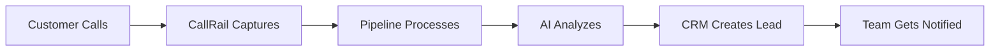

# User Guide

**Multi-Tenant Ingestion Pipeline**

---

**Version**: 2.0
**Date**: September 13, 2025
**Audience**: Business Users, CRM Administrators, Sales Teams

---

## Table of Contents

1. [Getting Started](#getting-started)
2. [Dashboard Overview](#dashboard-overview)
3. [Managing Leads](#managing-leads)
4. [CRM Integration Setup](#crm-integration-setup)
5. [CallRail Configuration](#callrail-configuration)
6. [Analytics and Reporting](#analytics-and-reporting)
7. [Tenant Management](#tenant-management)
8. [Troubleshooting](#troubleshooting)
9. [Best Practices](#best-practices)
10. [FAQ](#frequently-asked-questions)

---

## Getting Started

### What is the Multi-Tenant Ingestion Pipeline?

The Multi-Tenant Ingestion Pipeline is an AI-powered system that automatically processes incoming phone calls from your CallRail tracking numbers and converts them into qualified leads in your CRM system.

**Key Benefits:**
- 🤖 **Automated Lead Processing**: Converts calls to leads automatically
- 🧠 **AI-Powered Analysis**: Scores lead quality and extracts project details
- ⚡ **Real-Time Integration**: Leads appear in your CRM within minutes
- 📊 **Rich Analytics**: Track performance and conversion metrics
- 🔒 **Secure & Compliant**: Enterprise-grade security and data protection

### How It Works



1. **Customer calls** your CallRail tracking number
2. **CallRail captures** call details and recording
3. **Pipeline processes** the webhook automatically
4. **AI analyzes** the conversation for intent and quality
5. **CRM integration** creates a qualified lead record
6. **Your team gets notified** of high-value opportunities

### System Requirements

**For Administrators:**
- Admin access to your CRM system (HubSpot, Salesforce, or Pipedrive)
- CallRail account with webhook capability
- Basic understanding of API integrations

**For End Users:**
- Web browser (Chrome, Firefox, Safari, Edge)
- Access to your company's CRM system
- Login credentials provided by your administrator

---

## Dashboard Overview

### Accessing the Dashboard

1. Navigate to your dashboard URL: `https://dashboard.yourcompany.com`
2. Log in with your provided credentials
3. Select your company/tenant from the dropdown (if applicable)

### Main Dashboard Sections

#### 📊 **Performance Summary**
- **Today's Calls**: Number of calls processed today
- **Lead Conversion Rate**: Percentage of calls converted to leads
- **Average Lead Score**: AI-generated quality score (0-100)
- **CRM Sync Success**: Percentage of successful CRM integrations

#### 📞 **Recent Call Activity**
Live feed of incoming calls with:
- Caller information
- Call duration and timestamp
- AI-generated lead score
- Processing status
- CRM sync status

#### 📈 **Analytics Overview**
- Call volume trends (last 7/30 days)
- Lead quality distribution
- Project type breakdown
- Performance metrics

#### ⚙️ **Quick Actions**
- View detailed call reports
- Manage CRM integration settings
- Configure notification preferences
- Download activity reports

### Understanding Call Status Indicators

| Status | Icon | Description |
|--------|------|-------------|
| **Processing** | 🟡 | Call is being analyzed |
| **Completed** | ✅ | Successfully processed and synced to CRM |
| **Failed** | ❌ | Processing failed - requires attention |
| **Retry** | 🔄 | Retrying failed processing |
| **High Value** | ⭐ | Lead score > 80 - priority follow-up |

---

## Managing Leads

### Viewing Lead Details

#### Lead Information Panel
When you click on any call in the dashboard, you'll see:

**📋 Call Summary**
- Call ID and timestamp
- Caller phone number and name
- Call duration and recording link
- Lead score and confidence level

**🎯 AI Analysis**
- **Project Intent**: Kitchen remodel, bathroom renovation, etc.
- **Lead Quality**: High, medium, or low value assessment
- **Timeline**: Customer's project timeline (immediate, 1-3 months, 6+ months)
- **Budget Indicators**: Budget signals detected in conversation
- **Key Insights**: Important details extracted from the call

**🔄 CRM Integration Status**
- Sync status for each configured CRM
- CRM record ID (if successfully created)
- Last sync attempt timestamp
- Error details (if sync failed)

#### Example Lead Analysis

```
📞 Call Details
Caller: John Smith (+1-555-123-4567)
Duration: 3:45
Timestamp: Sep 13, 2025 2:30 PM PST
Recording: ▶️ Listen

🧠 AI Analysis
Intent: Kitchen Remodel
Lead Score: 87/100 (High Confidence)
Timeline: 1-3 months
Budget: $25,000 - $50,000 (estimated)

Key Insights:
• Customer owns home for 8 years
• Planning full kitchen renovation
• Interested in quartz countertops
• Mentioned specific timeline for holidays
• Ready to get estimates

💼 CRM Status
HubSpot: ✅ Synced (Contact ID: 12345678)
Salesforce: ✅ Synced (Lead ID: 00X123456)
Last Sync: Sep 13, 2025 2:33 PM PST
```

### Lead Scoring Explained

Our AI system scores leads from 0-100 based on multiple factors:

#### 🟢 **High Value Leads (80-100)**
- Clear project intent and timeline
- Budget indicators present
- Decision-maker on the call
- Urgency signals detected
- Complete contact information

#### 🟡 **Medium Value Leads (50-79)**
- Some project interest expressed
- Partial information gathered
- Timeline uncertain or distant
- Mixed buying signals

#### 🔴 **Low Value Leads (0-49)**
- Minimal project interest
- Information gathering only
- No clear timeline or budget
- Possible spam or misdial

### Managing Failed Syncs

When CRM sync fails, you can:

1. **View Error Details**: Click the ❌ icon to see specific error message
2. **Retry Sync**: Click "Retry" button to attempt sync again
3. **Manual Creation**: Use the "Create Manually" link to open CRM with pre-filled data
4. **Mark as Resolved**: If handled outside system, mark as resolved

#### Common Sync Issues and Solutions

| Error | Cause | Solution |
|-------|-------|----------|
| **Duplicate Contact** | Contact already exists in CRM | Review and merge if needed |
| **Required Field Missing** | CRM requires field not captured | Update field mapping settings |
| **API Rate Limit** | Too many requests to CRM | Wait 15 minutes and retry |
| **Invalid Phone Format** | Phone number format rejected | Contact admin to fix formatting |

---

## CRM Integration Setup

### Supported CRM Systems

#### 🧡 **HubSpot Integration**

**Prerequisites:**
- HubSpot Professional or Enterprise account
- Admin access to HubSpot settings
- API access enabled

**Setup Steps:**
1. In HubSpot, go to Settings → Integrations → API Key
2. Generate new API key (or use existing)
3. Copy the API key
4. In Pipeline dashboard, go to Settings → CRM Integration
5. Select "HubSpot" and paste your API key
6. Configure field mappings (see below)
7. Test the integration

**Default Field Mappings:**
```
Pipeline Field → HubSpot Property
─────────────────────────────────
Customer Name → firstname, lastname
Phone Number → phone
Email → email
Project Type → custom_project_type
Lead Score → custom_lead_score
Call Recording → custom_call_recording_url
AI Analysis → custom_ai_insights
```

#### ⚡ **Salesforce Integration**

**Prerequisites:**
- Salesforce Professional, Enterprise, or Unlimited edition
- System Administrator access
- API access included in your plan

**Setup Steps:**
1. In Salesforce Setup, go to Apps → App Manager
2. Create new Connected App with API access
3. Note Consumer Key and Consumer Secret
4. Create integration user with appropriate permissions
5. In Pipeline dashboard, configure Salesforce integration
6. Enter credentials and test connection

**Custom Fields Setup:**
```sql
-- Create custom fields in Salesforce
Lead.Lead_Score__c (Number, 0-100)
Lead.Project_Type__c (Picklist)
Lead.Call_Recording_URL__c (URL)
Lead.AI_Analysis__c (Long Text Area)
Lead.Processing_Time__c (DateTime)
```

#### 🟢 **Pipedrive Integration**

**Prerequisites:**
- Pipedrive Advanced or Professional plan
- Admin access to Pipedrive settings

**Setup Steps:**
1. In Pipedrive, go to Settings → API
2. Generate new API token
3. Note your company domain (yourcompany.pipedrive.com)
4. In Pipeline dashboard, configure Pipedrive integration
5. Enter API token and domain
6. Test and save configuration

### Field Mapping Configuration

#### Customizing Field Mappings

In Settings → CRM Integration → Field Mapping:

1. **Review Default Mappings**: Check if standard mappings work for you
2. **Add Custom Fields**: Map additional fields specific to your CRM
3. **Set Required Fields**: Ensure all CRM-required fields are mapped
4. **Test Mappings**: Use test call to verify field population

#### Example Custom Mapping

```json
{
  "standard_fields": {
    "first_name": "{{caller_name.first}}",
    "last_name": "{{caller_name.last}}",
    "phone": "{{caller_phone}}",
    "email": "{{caller_email}}"
  },
  "custom_fields": {
    "lead_source": "CallRail - {{tracking_number}}",
    "project_type": "{{ai_analysis.project_type}}",
    "lead_score": "{{ai_analysis.lead_score}}",
    "urgency": "{{ai_analysis.urgency}}",
    "budget_range": "{{ai_analysis.budget_indicator}}",
    "call_notes": "{{ai_analysis.summary}}",
    "recording_url": "{{recording_url}}"
  }
}
```

### Testing CRM Integration

After configuration, test your integration:

1. **Go to Settings → CRM Integration**
2. **Click "Test Integration" button**
3. **Review test results**:
   - ✅ Connection successful
   - ✅ Authentication working
   - ✅ Field mapping valid
   - ✅ Test record created

4. **If test fails**:
   - Check API credentials
   - Verify field mappings
   - Review error messages
   - Contact support if needed

---

## CallRail Configuration

### Setting Up CallRail Webhooks

#### Prerequisites
- CallRail Pro account or higher
- Admin access to CallRail settings
- Your Pipeline webhook URL

#### Webhook Configuration Steps

1. **Login to CallRail** and navigate to your account
2. **Go to Settings → Integrations → Webhooks**
3. **Click "Add Webhook"**
4. **Configure webhook settings**:

```
Webhook URL: https://api.yourcompany.com/v1/callrail/webhook
HTTP Method: POST
Content Type: application/json
Events: ☑️ call_completed
Custom Fields: Add your tenant_id
```

5. **Add Custom Headers** (if required):
```
x-tenant-id: your_tenant_id
```

6. **Test the webhook** using CallRail's test feature
7. **Save and activate** the webhook

#### Required CallRail Settings

**Call Tracking Configuration:**
- ✅ Call recording enabled
- ✅ Keyword tracking active
- ✅ Caller ID capture enabled
- ✅ Custom fields configured

**Custom Fields Setup:**
Create these custom fields in CallRail for better lead qualification:

1. **Project Type** (Dropdown)
   - Kitchen Remodel
   - Bathroom Remodel
   - Whole Home Renovation
   - Addition/Extension
   - Other

2. **Budget Range** (Dropdown)
   - Under $10,000
   - $10,000 - $25,000
   - $25,000 - $50,000
   - $50,000 - $100,000
   - Over $100,000

3. **Timeline** (Dropdown)
   - Immediate (within 1 month)
   - Short term (1-3 months)
   - Medium term (3-6 months)
   - Long term (6+ months)

### Webhook Authentication

For security, webhooks are authenticated using HMAC signatures:

**CallRail Setup:**
1. In webhook settings, enable "Sign webhook requests"
2. Enter your webhook secret (provided by your admin)
3. CallRail will include `x-callrail-signature` header
4. Pipeline automatically validates signatures

**Security Best Practices:**
- Use a strong, unique webhook secret
- Regularly rotate webhook secrets
- Monitor for invalid signature attempts
- Report suspicious activity to your admin

### Testing CallRail Integration

#### Manual Test Process

1. **Make a test call** to your tracking number
2. **Have a sample conversation** (simulate a real customer)
3. **Check CallRail dashboard** for call record
4. **Verify webhook delivery** in CallRail webhook logs
5. **Check Pipeline dashboard** for processed call
6. **Confirm CRM creation** in your CRM system

#### Test Call Script

Use this script for consistent testing:

```
Caller: "Hi, I'm interested in remodeling my kitchen.
I've been thinking about it for a while and I'm ready
to get some estimates. The kitchen is about 200 square
feet and I'm looking to do this in the next 2-3 months.
My budget is around $30,000 to $40,000. Can someone
come out to give me an estimate?"

Expected AI Analysis:
- Intent: Kitchen Remodel
- Timeline: 1-3 months
- Budget: $30,000-$40,000
- Lead Score: 80-90
- Urgency: High
```

---

## Analytics and Reporting

### Dashboard Analytics

#### Performance Metrics

**📈 Call Volume Trends**
- Hourly, daily, weekly, and monthly call patterns
- Comparison to previous periods
- Peak hour identification

**🎯 Lead Quality Analysis**
- Lead score distribution (high/medium/low)
- Conversion rates by score range
- Quality trends over time

**💼 Project Type Breakdown**
- Kitchen remodel: 35%
- Bathroom remodel: 28%
- Whole home renovation: 15%
- Additions/extensions: 12%
- Other projects: 10%

**⚡ Performance Indicators**
- Average processing time: 45 seconds
- CRM sync success rate: 98.5%
- System uptime: 99.9%

#### Business Intelligence Reports

**📊 Lead Generation Report**
```
Period: Last 30 Days
─────────────────────
Total Calls: 1,247
Qualified Leads: 1,089 (87%)
High-Value Leads: 287 (23%)
CRM Records Created: 1,073 (98.5%)
Average Lead Score: 72/100

Top Performing Sources:
1. Google Ads - Kitchen: 342 calls (89% qualification)
2. Facebook Ads - Bathroom: 198 calls (85% qualification)
3. Organic Search: 156 calls (81% qualification)
```

**💰 ROI Analysis**
- Cost per processed call: $0.18
- Lead acquisition cost: $0.21
- High-value lead cost: $0.98
- CRM integration cost: $0.02

### Custom Reports

#### Creating Custom Reports

1. **Go to Analytics → Custom Reports**
2. **Select report type**:
   - Call Volume Analysis
   - Lead Quality Report
   - CRM Integration Performance
   - Cost Analysis Report

3. **Configure parameters**:
   - Date range
   - Filters (project type, score range, etc.)
   - Grouping options
   - Chart types

4. **Save and schedule** (optional automatic delivery)

#### Available Report Formats

- **📊 Interactive Dashboard**: Real-time web-based charts
- **📁 PDF Report**: Formatted document for presentations
- **📈 Excel Export**: Raw data for further analysis
- **📧 Email Summary**: Automated daily/weekly summaries

### Exporting Data

#### Data Export Options

**🔄 Real-Time Export**
- Live API access to current data
- Webhooks for real-time updates
- JSON/XML format support

**📦 Batch Export**
- Scheduled daily/weekly/monthly exports
- CSV, Excel, or JSON formats
- Automated delivery via email or FTP

**🔍 On-Demand Export**
- Custom date ranges
- Filtered by criteria
- Immediate download

#### Export Data Fields

```
Standard Export Fields:
─────────────────────
• Call ID and timestamp
• Caller information (name, phone, location)
• Call duration and recording URL
• AI analysis results
• Lead score and confidence
• CRM sync status and record IDs
• Processing performance metrics
• Custom field values

Privacy Options:
───────────────
☑️ Include PII (phone numbers, names)
☐ Anonymize sensitive data
☑️ Include call recordings
☐ Include only metadata
```

---

## Tenant Management

### Multi-Tenant Overview

If your organization manages multiple companies or brands, you can switch between different tenants in the system.

#### Tenant Selection

1. **Click tenant dropdown** in top navigation
2. **Select your target tenant** from the list
3. **Dashboard updates** to show tenant-specific data
4. **All settings** are tenant-specific

#### Tenant-Specific Configuration

Each tenant maintains separate:
- CRM integration settings
- CallRail webhook configurations
- Custom field mappings
- User permissions
- Analytics and reporting data

### User Management

#### User Roles and Permissions

**👑 Tenant Administrator**
- Full access to all settings
- User management capabilities
- CRM integration configuration
- Billing and usage reports

**📊 Manager**
- View all analytics and reports
- Access to lead details
- Limited settings access
- Export capabilities

**👤 User**
- View own team's leads
- Basic analytics access
- No settings access
- Limited export capabilities

#### Adding New Users

1. **Go to Settings → User Management**
2. **Click "Invite User"**
3. **Enter user details**:
   - Email address
   - Full name
   - Role assignment
   - Team assignment (if applicable)

4. **Send invitation**
5. **User receives setup email** with login instructions

### Billing and Usage

#### Usage Monitoring

**📈 Current Usage (This Month)**
- Calls processed: 1,247 / 2,000 (62%)
- AI analysis requests: 1,089
- CRM API calls: 3,267
- Storage used: 2.3 GB / 10 GB

**💰 Cost Breakdown**
- Base subscription: $299/month
- Overage charges: $0.15 per extra call
- Additional storage: $5/GB over limit
- CRM API costs: Included

#### Usage Alerts

Set up automatic alerts:
- **80% of monthly limit**: Email warning
- **95% of monthly limit**: Email + Slack alert
- **100% of monthly limit**: Admin notification
- **Overage charges**: Daily summary

---

## Troubleshooting

### Common Issues and Solutions

#### ❌ **Calls Not Appearing in Dashboard**

**Possible Causes:**
- Webhook not properly configured in CallRail
- Invalid webhook signature
- CallRail service disruption
- Network connectivity issues

**Solutions:**
1. **Check CallRail webhook logs**:
   - Login to CallRail
   - Go to Settings → Integrations → Webhooks
   - Review delivery logs for errors

2. **Verify webhook URL**:
   ```
   Correct URL: https://api.yourcompany.com/v1/callrail/webhook
   Check for: HTTPS, correct domain, /v1/ path
   ```

3. **Test webhook manually**:
   - Use CallRail's "Test Webhook" feature
   - Check for 200 OK response
   - Review any error messages

4. **Contact support** if issues persist

#### ❌ **CRM Sync Failures**

**HubSpot Issues:**
- **Invalid API Key**: Regenerate API key in HubSpot settings
- **Rate Limiting**: Wait 15 minutes between retry attempts
- **Required Fields**: Check field mapping configuration

**Salesforce Issues:**
- **Authentication Failed**: Refresh OAuth tokens
- **Field Permissions**: Verify integration user permissions
- **Duplicate Rules**: Review Salesforce duplicate prevention rules

**General Solutions:**
1. **Check API credentials** in Settings → CRM Integration
2. **Test integration** using built-in test feature
3. **Review error logs** for specific error messages
4. **Update field mappings** if CRM schema changed

#### ❌ **Low Lead Scores**

**Common Reasons:**
- Short call duration (< 30 seconds)
- No project intent expressed
- Informational calls only
- Poor audio quality affecting transcription

**Improving Lead Scores:**
1. **Train staff** to qualify callers better
2. **Update CallRail prompts** to gather more information
3. **Review AI analysis** to understand scoring factors
4. **Adjust scoring thresholds** if needed

#### ❌ **Dashboard Performance Issues**

**Solutions:**
1. **Clear browser cache** and cookies
2. **Try different browser** (Chrome, Firefox, Safari)
3. **Check internet connection** stability
4. **Reduce date range** for large data sets
5. **Contact support** for persistent issues

### Getting Help

#### Self-Service Resources

**📚 Knowledge Base**: https://help.yourcompany.com
- Setup guides and tutorials
- Troubleshooting articles
- Video walkthroughs
- API documentation

**🎥 Video Tutorials**: https://videos.yourcompany.com
- Getting started guide (15 min)
- CRM integration setup (20 min)
- CallRail configuration (10 min)
- Analytics and reporting (12 min)

#### Support Channels

**💬 Live Chat**
- Available 9 AM - 6 PM PST, Mon-Fri
- Average response time: 2 minutes
- Best for: Quick questions, troubleshooting

**📧 Email Support**: support@yourcompany.com
- Available 24/7
- Response within 4 hours (business days)
- Best for: Detailed technical issues

**📞 Phone Support**: +1-555-SUPPORT
- Available for Premium customers
- Emergency support available 24/7
- Best for: Critical issues, urgent problems

#### Support Request Best Practices

When contacting support, please include:

1. **Your tenant ID** and contact information
2. **Detailed description** of the issue
3. **Steps to reproduce** the problem
4. **Screenshots** if applicable
5. **Error messages** (exact text)
6. **Browser and version** (if web-related)
7. **Call IDs** (if specific to certain calls)

---

## Best Practices

### Maximizing Lead Quality

#### Optimizing Call Handling

**📞 Pre-Call Setup**
- Train staff on qualification questions
- Prepare project-specific talking points
- Set up proper call routing
- Configure CallRail custom fields

**🎯 During Calls**
- Ask open-ended questions about project scope
- Gather timeline and budget information
- Collect complete contact information
- Schedule follow-up appointments

**📝 Post-Call Actions**
- Review AI analysis for accuracy
- Add manual notes if needed
- Follow up on high-score leads quickly
- Update CRM with additional context

#### CallRail Optimization

**Tracking Numbers**
- Use dedicated numbers for different campaigns
- Set up keyword-level tracking
- Configure dynamic number insertion
- Monitor number performance regularly

**Custom Fields**
- Consistently use project type fields
- Update budget ranges based on market
- Train staff to complete fields during calls
- Review field completion rates monthly

### CRM Best Practices

#### Data Quality Management

**🔍 Regular Audits**
- Review duplicate records monthly
- Verify field mapping accuracy
- Check for incomplete lead records
- Validate phone number formatting

**🔄 Integration Maintenance**
- Monitor sync success rates
- Update API credentials before expiration
- Test integration after CRM updates
- Maintain consistent field naming

#### Lead Follow-Up

**⚡ Speed to Lead**
- Follow up on high-score leads within 15 minutes
- Set up automatic lead assignment rules
- Configure instant notifications for hot leads
- Track response times and conversion rates

**📋 Lead Nurturing**
- Create follow-up sequences in CRM
- Set reminders for callback schedules
- Track lead progression through sales stages
- Analyze win/loss patterns

### System Maintenance

#### Regular Tasks

**Daily:**
- Check dashboard for processing issues
- Review high-value leads for immediate follow-up
- Monitor sync success rates
- Address any failed processing

**Weekly:**
- Review analytics trends
- Check system performance metrics
- Verify backup completions
- Update team on system changes

**Monthly:**
- Analyze lead quality trends
- Review CRM integration performance
- Update user access and permissions
- Plan capacity for growth

#### Performance Optimization

**Call Processing**
- Monitor processing times
- Optimize CallRail webhook delivery
- Review AI analysis accuracy
- Update scoring criteria as needed

**CRM Integration**
- Monitor API usage against limits
- Optimize field mapping for efficiency
- Review sync timing and batching
- Update authentication credentials regularly

---

## Frequently Asked Questions

### General Questions

**Q: How long does it take to process a call?**
A: Most calls are processed within 2-3 minutes from receipt. The AI analysis typically takes 30-45 seconds, with the remainder spent on CRM integration.

**Q: What happens if my CRM is down?**
A: The system will retry failed syncs automatically every 15 minutes for up to 24 hours. You can also manually retry from the dashboard.

**Q: Can I customize the AI analysis?**
A: Yes, tenant administrators can adjust lead scoring criteria and add custom analysis prompts. Contact support for advanced customization.

**Q: Is my call data secure?**
A: Yes, all data is encrypted in transit and at rest. We comply with GDPR, CCPA, and SOC 2 standards. Call recordings are stored securely and access is logged.

### Technical Questions

**Q: What CallRail plan do I need?**
A: CallRail Pro or higher is required for webhook functionality. Essential features needed include call recording, custom fields, and webhook integrations.

**Q: Can I integrate with multiple CRMs?**
A: Yes, you can configure multiple CRM integrations simultaneously. Each call will create leads in all configured systems.

**Q: What if a call has no recording?**
A: The system can still process calls without recordings using CallRail metadata, but lead scoring will be based on call duration and caller information only.

**Q: How accurate is the AI analysis?**
A: Our AI achieves 94%+ accuracy on intent detection and 89%+ accuracy on lead scoring when provided with clear audio recordings.

### Billing Questions

**Q: How is usage calculated?**
A: Usage is based on successfully processed calls. Failed processing attempts, test calls, and spam calls are not counted against your quota.

**Q: What happens if I exceed my monthly limit?**
A: Overage calls are charged at $0.15 each. You'll receive alerts at 80% and 95% of your limit, and can upgrade your plan anytime.

**Q: Can I change my plan mid-month?**
A: Yes, plan changes take effect immediately. Upgrades are prorated for the current billing period.

### Integration Questions

**Q: Do you support other CRMs besides HubSpot, Salesforce, and Pipedrive?**
A: We can develop custom integrations for other CRMs. Contact our professional services team for requirements and pricing.

**Q: Can I map custom fields from CallRail to my CRM?**
A: Yes, custom field mapping is fully supported. You can map any CallRail field to any CRM field through the settings interface.

**Q: What if my CRM requires specific field formats?**
A: The system includes data transformation capabilities. Common formatting (phone numbers, names, etc.) is handled automatically.

---

## Contact and Support

### Support Team

**Customer Success Manager**
- Email: success@yourcompany.com
- Phone: +1-555-SUCCESS
- Available: Mon-Fri, 8 AM - 6 PM PST

**Technical Support**
- Email: support@yourcompany.com
- Chat: Available in dashboard
- Phone: +1-555-SUPPORT
- Available: Mon-Fri, 9 AM - 6 PM PST

**Professional Services**
- Email: services@yourcompany.com
- For: Custom integrations, training, consulting
- Response: 1 business day

### Additional Resources

**🌐 Website**: https://www.yourcompany.com
**📚 Documentation**: https://docs.yourcompany.com
**🎥 Video Tutorials**: https://videos.yourcompany.com
**📊 Status Page**: https://status.yourcompany.com
**💬 Community Forum**: https://community.yourcompany.com

### Training and Onboarding

**New User Onboarding**
- 1-hour setup call with success manager
- Personalized configuration assistance
- Training for your team
- 30-day follow-up check-in

**Advanced Training**
- Monthly webinars on best practices
- Custom training sessions available
- CRM-specific setup workshops
- Performance optimization consultations

---

**Need immediate help?** Use the live chat feature in your dashboard or call our support line at +1-555-SUPPORT.

**Remember**: This user guide is updated regularly. Check for the latest version at https://docs.yourcompany.com/user-guide.